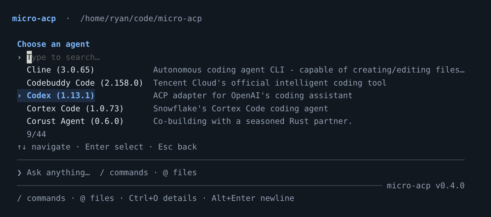
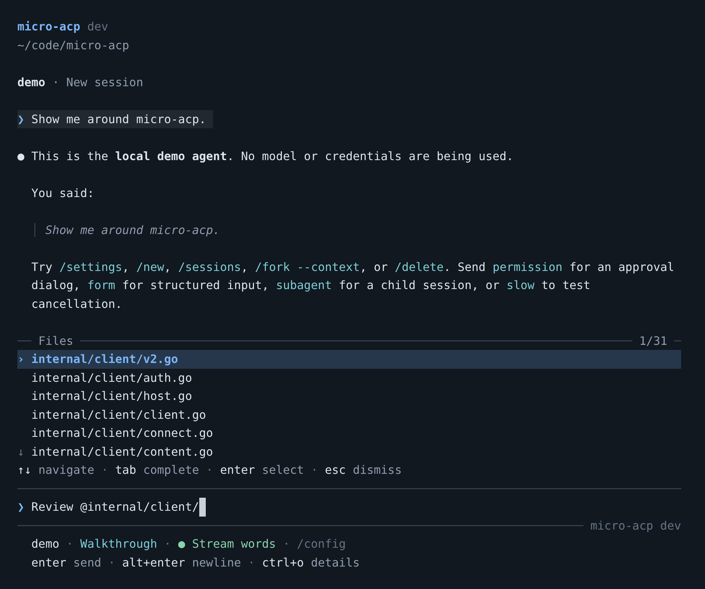
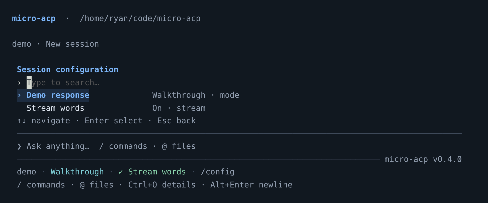
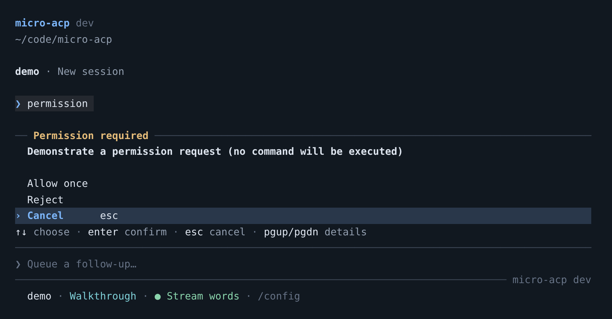
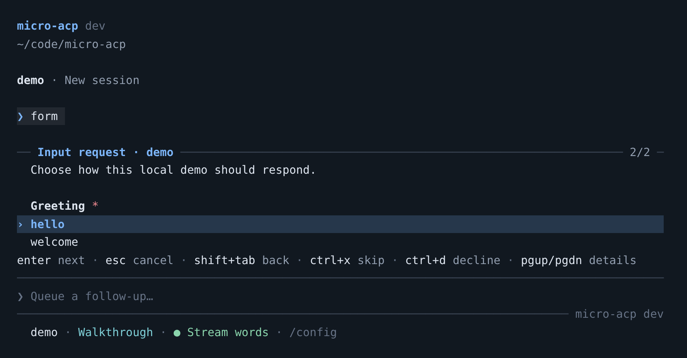

# micro-acp

[](https://github.com/BrokkAi/micro-acp/actions/workflows/ci.yml)
[](LICENSE)

A small, entirely Go terminal client for [Agent Client Protocol](https://agentclientprotocol.com/). Built on [BrokkAi/acp-go](https://github.com/BrokkAi/acp-go), Bubble Tea v2, Bubbles v2, Lip Gloss v2, and Glamour v2.

A conversation and a growing prompt in your normal terminal. Type `/` for inline command suggestions or `@` to search workspace files. Completed output stays in terminal scrollback; mouse selection and copying keep working. Choose models and modes, inspect tools and diffs, answer permission and input requests, and manage sessions from the prompt. See the [ACP support matrix](docs/acp-support.md) for protocol coverage and limitations.

## Screenshots

Captured from the running application. The agent picker shows the live registry;
the conversation and dialogs use `./bin/micro-acp --demo`, which exercises the
real ACP connection and terminal UI without model credentials.

**Agent selection.** Start `micro-acp` to browse agents and their resolved
versions. Type to filter, use the arrow keys to navigate, and press Enter to
connect. You can reopen the picker with `/agents` or Ctrl+G.



**Conversation and file context.** Responses render as Markdown; typing `@`
opens workspace file suggestions while keeping your prompt in the composer.



<details>
<summary>See session settings, permission prompts, and structured input</summary>

**Session settings.** `/config` opens searchable options supplied by the agent.
The demo offers a response mode and a streaming toggle; current values stay
visible below the prompt.



**Permission prompts.** Review the agent's request and choose an action with
the keyboard. The initial selection is Cancel.



**Structured input.** Answer an agent's form one field at a time, then review
your answers before submitting.



</details>

## Run

Tagged [releases](https://github.com/BrokkAi/micro-acp/releases) provide Linux, macOS, and Windows binaries for amd64 and arm64. Linux and macOS archives are `.tar.gz`; Windows archives are `.zip`. Each archive includes the executable, README with screenshots, ACP support matrix, and MIT license; `checksums.txt` contains SHA-256 checksums. Extract the archive and put `micro-acp` (or `micro-acp.exe`) on your PATH. Prebuilt binaries do not require Go.

Building from source requires **Go 1.27.1 or newer**, matching `acp-go`'s toolchain requirement:

```sh
make build
./bin/micro-acp --demo
```

Run these commands from a checkout of this repository. `make build` embeds the
Git-derived version; `make build VERSION=...` overrides it. A plain
`go build -o bin/micro-acp .` also works and reports `dev`. The prompt's lower
border shows `micro-acp <version>`. It uses the same build version as
`--version`, ACP client identity, and registry requests.

On Windows, build with `go build -o bin/micro-acp.exe .` and run
`bin\micro-acp.exe --demo`. `make` is not required and is not part of a stock
Windows install.

The demo runs a local ACP subprocess with persistent sessions and streaming text. It needs no model credentials and performs no coding work. Try `/mode` or `/settings`, send `permission` for an approval prompt, `form` for structured input, or `slow` to test cancellation. Demo settings reset when its process restarts.

Connect to a real agent:

```sh
./bin/micro-acp                         # Search the registry; Enter connects
./bin/micro-acp agents                 # Fetch and list current registry entries
./bin/micro-acp --agent <registry-id>
./bin/micro-acp --cwd /path/to/project --agent <registry-id>
```

Agents use their own accounts and authentication. Existing environment variables and credentials are inherited. `/auth` opens the offered login methods; `/auth <method-id>` selects one directly. Agent-managed login displays stderr output and handles input requests. Terminal login temporarily suspends the TUI, runs the agent's advertised login flow, then reconnects and reinitializes the agent. Authentication-required errors open the login picker automatically.

The agent picker shows each adapter's resolved version beside its name. The picker and `micro-acp agents` also include these built-in entries:

| Agent ID | Server | Launch |
| --- | --- | --- |
| `anvil` | [BrokkAi/anvil](https://github.com/BrokkAi/anvil) | Resolves npm's `latest` and launches `npx --yes @brokkai/anvil@<version>`; requires Node.js/npm. |
| `muse-acp` | [BrokkAi/muse-acp](https://github.com/BrokkAi/muse-acp) | Resolves npm's `latest` and launches `npx --yes @brokkai/muse-acp@<version>`; requires Node.js/npm and Muse Code installed and authenticated. |
| `draupnir` | [foundev/draupnir](https://github.com/foundev/draupnir) | Downloads the latest native release. |

For example, run `micro-acp --agent anvil`, `micro-acp --agent muse-acp`, or `micro-acp --agent draupnir`. Draupnir downloads support Linux (glibc) and macOS on amd64 and arm64, using its universal macOS archive. Downloads are verified against GitHub's SHA-256 asset digest and installed in the private cache. npm and GitHub release metadata are checked while loading the catalog and on `/refresh`; launching uses the exact version displayed. A failed lookup falls back to validated cached metadata. `--offline` requires cached version metadata and, for native agents, a previously installed executable. Built-in entries remain visible when the official registry is unavailable. An entry with no resolvable version is shown as unavailable until `/refresh` succeeds. Matching published registry entries take precedence over built-ins, and custom agent configurations take precedence over both.

## Run a single prompt

`exec` sends one prompt and prints the reply without opening the TUI, so scripts, CI jobs, and tooling harnesses can drive an agent:

```sh
./bin/micro-acp --agent <registry-id> exec "summarize the failing tests"
echo "explain this stack trace" | ./bin/micro-acp --agent <registry-id> exec -
./bin/micro-acp --demo exec "hello"
./bin/micro-acp exec -- /absolute/path/to/my-agent --acp   # prompt from stdin
```

Flags must precede `exec`. Run `micro-acp agents` to list valid agent ids.

| Flag | Default | Purpose |
| --- | --- | --- |
| `--format text\|json\|stream-json` | `text` | Print the final reply, one JSON result object, or newline-delimited JSON events as the turn streams. |
| `--permission allow\|deny\|fail` | `deny` | Answer the agent's permission requests without a prompt. |
| `--timeout <duration>` | `0` | Overall deadline such as `90s`; `0` means no limit. |
| `--save` | off | Persist the session locally. Runs are ephemeral by default and leave no local trace. |

Resume an existing conversation with `--session <local-id>`, which persists updates. The client advertises no elicitation support during `exec`, so agents ask for form or URL input only when they ignore that and it is declined; use the TUI when a flow needs interactive input. An agent that requires login exits `3` with its login method ids; authenticate first with `micro-acp login`.

Exit codes: `0` normal, `1` error, `2` usage, `3` authentication required, `4` permission denied, `5` timeout, `6` the agent stopped for another reason.

## Logging in

`login` authenticates an agent without opening the TUI. With no `--method` it lists the methods the agent advertises, so scripts can discover the available ids:

```sh
./bin/micro-acp --agent <registry-id> login                       # list methods
./bin/micro-acp --agent <registry-id> --method <method-id> login  # run one
./bin/micro-acp login -- /path/to/my-agent --acp                  # custom command
```

Terminal methods re-invoke the agent with its advertised arguments and hand the login process the terminal, exactly like `/auth` in the TUI. Agent-managed methods use the ACP `authenticate` call. A headless login advertises no elicitation support, so a flow that needs form or URL input still needs the TUI. Existing environment variables and credentials are inherited.

Exit codes: `0` success, `1` the login flow failed, `2` usage or an unknown method, `3` the agent offers no login methods.

## Custom agents

`micro-acp --help` lists all launch flags. Put flags before the subcommand or
the `--` that introduces a custom agent:

| Flag | Purpose |
| --- | --- |
| `--agent <id>` | Select a registry or configured agent instead of opening the picker. |
| `--cwd <directory>` | Select the workspace; defaults to the current directory or a resumed session's saved workspace. |
| `--session <local-id>` | Resume a saved session. |
| `--config <file>` | Read a specific configuration file; a missing explicit file is an error. |
| `--offline` | Use cached discovery metadata and installed native agents. |
| `--demo` | Run the credential-free local demo. |
| `--method <id>` | Login method for `login`, as listed by `micro-acp login`. |
| `--format`, `--permission`, `--timeout`, `--save` | Output, permission policy, deadline, and persistence for `exec`. |
| `--version` | Print the build version and exit. |

Pass a stdio ACP executable and its arguments after `--`:

```sh
./bin/micro-acp -- /absolute/path/to/my-agent --acp
./bin/micro-acp --cwd /path/to/project -- my-agent serve
```

Commands are executed directly as argv, without a shell. Flags for micro-acp must precede `--` or the subcommand. The executable must speak ACP over stdin/stdout and send its logs to stderr.

For reusable configurations, run `micro-acp config` to see paths and an example, then create the indicated `config.json`:

```json
{
  "default_agent": "my-agent",
  "agents": {
    "my-agent": {
      "command": "/absolute/path/to/my-agent",
      "args": ["--acp"],
      "env": { "MY_AGENT_SETTING": "value" }
    }
  }
}
```

Custom agent names take precedence over matching registry IDs. Keep secrets in your environment when possible. A different file can be selected with `--config /path/to/config.json`.

`default_agent` selects the agent connected at startup when neither `--agent`
nor a saved session chooses one. `registry_url` optionally replaces the
official registry endpoint; omit it to use the default. `micro-acp config`
prints paths and a sample; it does not create or edit the file.

Configure MCP servers and additional workspace directories in the same file:

```json
{
  "session": {
    "additional_directories": ["/absolute/path/to/shared-library"],
    "mcp_servers": [
      {
        "name": "local-tools",
        "command": "/absolute/path/to/mcp-server",
        "args": [],
        "env": []
      },
      {
        "type": "http",
        "name": "remote-tools",
        "url": "https://example.com/mcp",
        "headers": []
      }
    ]
  }
}
```

MCP entries use ACP's stdio, HTTP, or SSE server schema. The agent manages these servers. Optional transports and additional directories require advertised agent support. Relative additional directories resolve against `--cwd`; saved sessions retain their directory list. Current MCP configuration is sent on new, load, resume, and fork operations.

## Sessions

| Command | Behavior |
| --- | --- |
| `/new` | Create a new agent session. |
| `/close` | Close the active session on the agent while preserving saved history; requires agent support. |
| `/sessions` | Search saved sessions and the agent's session list for the current workspace. |
| `/load <local-id>` | Resume a saved session using the agent's resume or load capability. |
| `/fork` | Fork natively when the agent advertises the optional `session/fork` capability. |
| `/fork --context` | Create a new session and attach saved user/assistant text to its first prompt. |
| `/delete` | Confirm deletion from both the agent and local history; requires agent support. |
| `/forget` | Confirm removal from local history only. The agent keeps its copy. |

Session metadata and transcripts survive restarts. List and resume them from the shell:

```sh
./bin/micro-acp sessions
./bin/micro-acp --session <local-id>
./bin/micro-acp sessions forget <local-id>
```

Resuming infers the saved agent and workspace. Named custom agents must still exist in your configuration. For an inline custom command, supply that same command again after `--`. The session picker only lists the connected agent's current workspace; use the shell's `sessions` command to see all workspaces.

Native session operations depend on the agent's advertised capabilities. A context fork preserves text conversation only: it does not clone the agent's hidden state, tool history, or workspace files. No historical requests are replayed as separate prompts. Loading an existing session requires agent support. `/forget` does not delete remote sessions, so they may reappear in the agent's session list.

## Models, tools, and context

The persistent status line below the prompt shows compact values for the connected agent, model, reasoning, mode, and custom settings. A green `✓` marks enabled toggles; a muted `○` marks disabled ones. Reported context appears as the percentage remaining, followed by cost when available. Colors adapt to light and dark terminals. The line stays visible while composing, running a turn, or displaying an error. It wraps to two lines when needed; `+N more · /config` indicates fields that do not fit. Full option names and On/Off values remain available in `/config`.

`/config` opens all agent-provided session options with their current values; `/settings` is an alias. Type `/config ` to complete an option ID, then its offered values. `/config <id>` opens that option, and `/config <id> <value>` sets it directly. For example, the demo accepts `/config stream false`. The options come from ACP, including arbitrary categories, grouped choices, and booleans. Open selectors and suggestions refresh when the agent updates its configuration.

`/model`, `/mode`, and `/effort` are shortcuts to the corresponding options, with completion and direct values such as `/model <id>`. Model changes refresh dependent choices such as reasoning effort.

Responses stream as Markdown. Tool calls appear as compact status rows with file-change summaries. Tool titles use cyan for reads/searches, amber for commands, blue for edits, and red for failures/deletions; file paths and change labels are colored separately. Reasoning and terminal output stay compact too, with success, warning, and error lines highlighted. Agent plans appear in a live checklist above the prompt, with completed (✓), current (›), and pending (○) steps, explicit high/medium/low priorities, and a completion count. Long plans keep the current step visible.

Press **Ctrl+O** or run `/details` for a scrollable transcript with labeled tool inputs and results, multiline output, file locations, and unified diffs with green additions and red removals. Structured payloads appear as readable fields and lists; full plan history, reasoning, and client terminal output are included. Press Esc to return to your draft. Tool updates retain earlier details when a later update only changes status. Original tool payloads and non-text content are preserved in session files; images and audio appear as descriptive markers in the terminal.

Agent-provided slash commands appear alongside client commands as you type `/`. Up/Down selects a suggestion, Tab completes it, and Enter runs it; commands that need arguments leave the cursor ready for those arguments. Unknown slash commands are sent to the agent as prompts. If an agent command shares a client command's name, use `/agent <command>`, for example `/agent new`. Compaction is available through an agent's advertised command when it offers one.

Attach context using:

```text
Review @internal/client/client.go
Explain @"docs/a file with spaces.md"
/attach /path/to/screenshot.png
/resource https://example.com/specification
/detach
```

Typing `@` immediately shows matching workspace files. Git workspaces include tracked and untracked files and honor `.gitignore`. Enter or Tab inserts the selected reference at the cursor, preserving surrounding text; selecting a file does not send the prompt. Escape dismisses suggestions and keeps the draft. Paths containing spaces are quoted automatically. The file index refreshes after agent turns so newly created files become available. `/attach` queues a file for the next prompt; `/detach` clears queued attachments and resource links. Each attachment is limited to 4 MiB. Text uses embedded context when supported and plain text otherwise. Images, audio, and binary resources require the matching agent capability. Resource links are passed to the agent without fetching them. Enter can send queued attachments without accompanying text.

Form requests support strings, numbers, integers, booleans, single choices, and multiple choices, with defaults and validation. Enter advances, Shift+Tab goes back, Space toggles multiple choices, and Ctrl+X skips an optional field. Review answers before selecting Submit. Ctrl+D declines and Esc cancels. URL requests show the agent, host, and complete address; selecting Submit opens the system browser. No URL opens automatically.

## Keyboard and commands

| Key | Action |
| --- | --- |
| Enter | Send a prompt; steer the active turn when supported, otherwise queue it. Select a list entry or save an edited queue entry. |
| Alt+Enter / Ctrl+J | Insert a newline. Shift+Enter also works in compatible terminals. |
| Ctrl+P | Compact command search. |
| Ctrl+O | Expand full transcript and tool details; press again or Esc to return. |
| Ctrl+G | Agent picker. |
| Ctrl+S | Session picker. |
| Ctrl+N | New session. |
| Tab | Complete the selected suggestion; otherwise queue a follow-up while the agent works. |
| Alt+Up | Edit the latest queued prompt, keeping the current draft for later; otherwise recall prompt history. |
| Up, Down / Alt+Down | Recall prompt history; Up works on the first input line. |
| Terminal scrollback / mouse wheel | Scroll completed output; mouse selection is available. |
| Page Up / Page Down | Scroll expanded details and dialog explanations. |
| Esc | Restore an edited queue entry and the previous draft; otherwise dismiss suggestions/dialogs or stop the active turn. |
| Ctrl+C | Stop an active turn; otherwise clear a draft, or press twice on an empty prompt to exit. |
| Ctrl+D | Exit from an empty, idle prompt. |
| Type in a selector | Filter immediately; one Enter selects, Esc returns to the draft. |
| Ctrl+D in the session picker | Confirm deletion, or local removal if remote deletion is unsupported. |
| Ctrl+D in the queue picker | Remove the selected queued prompt. |

You can compose while the agent works. **Enter steers** an active turn when the agent advertises steering, including current Codex and Claude ACP adapters. **Tab queues** a separate follow-up, after any visible completion suggestion is handled. Agents without steering support queue Enter submissions too. Pending prompts appear above the composer and run in order after a successful turn.

**Alt+Up** edits the latest queued prompt; `/queue` selects any entry. Editing pauses dispatch, retains the entry's position and attachments, and saves the draft you were typing. Enter saves the edit; Esc restores the original entry. Both return to your previous draft. Use Ctrl+D in `/queue` to remove an entry, `/queue clear` to remove queued work, and `/queue send` to resume after a stop or failure. An unconfirmed steering delivery stays in a paused queue for review instead of being resent automatically. Queues stay tied to their original session and remain in memory; they are not saved across restarts. Multiline paste stays in the draft until you send it.

Other commands: `/agents`, `/help`, `/info`, `/auth`, `/logout`, `/refresh`, `/quit`. `/info` displays advertised capabilities and configuration. `/logs` shows recent agent stderr and the last error; `/reconnect` restarts the agent and reloads the saved session when supported. `/logout` requires the agent's logout capability.

Permission dialogs show the tool details and the agent's choices and default to **Cancel**. Page Up/Down scroll long explanations while the active input and action choices stay visible. No automatic approval is enabled. Filesystem and terminal callbacks use `acp-go/clienthost`, rooted at the workspace and configured additional directories. This client keeps one active session per agent connection and releases its terminals on session switches. Agents and their subprocesses run with your account's OS permissions; this is not an OS sandbox.

## Registry and storage

At startup, micro-acp revalidates the [official latest registry](https://github.com/agentclientprotocol/registry) at `https://cdn.agentclientprotocol.com/registry/v1/latest/registry.json`. `/refresh` checks it again. There is no bundled list of agent versions. The next agent connection uses the selected registry distribution; already running processes are not replaced in the middle of a session.

Supported distributions:

- `npx`: requires Node.js/npm; launches the registry's exact package spec with `npx --yes`.
- `uvx`: requires `uv`; launches the registry's package spec.
- Native binaries: downloads for the current OS/architecture, verifies SHA-256 when supplied, and installs into a private cache. ZIP, tar.gz, tar.bz2, and raw executable distributions are supported. Archives containing symlinks, special files, or unsafe paths are rejected.

When a refresh fails, a valid cached registry is used with a warning. With no cache, built-in and custom agents remain available in the TUI and CLI list. `--offline` deliberately uses the cache and prevents native binary downloads; it does not guarantee that an agent's package manager or the agent itself can run without network access. The demo does not fetch the registry.

Default paths follow the XDG variables:

| Data | Default path |
| --- | --- |
| Configuration | `~/.config/micro-acp/config.json` |
| Sessions | `~/.local/state/micro-acp/sessions/` |
| Registry and binaries | `~/.cache/micro-acp/` |

Set `MICRO_ACP_HOME` to keep config, data, and cache under one directory. Session files are written atomically with private permissions. Saving happens before and after each prompt and on orderly shutdown; a hard crash can lose the currently streaming response. Concurrent instances should use different sessions, since writes to the same saved session use last-writer-wins semantics.

Under `MICRO_ACP_HOME`, the paths are `config.json`, `data/sessions/`, and
`cache/`. This override takes precedence over the XDG variables; `--config`
then overrides only the configuration file. Demo history lives under `demo/`
in the state directory (`data/demo/` with `MICRO_ACP_HOME`).

The client targets stable **ACP v1** using `BrokkAi/acp-go`, pinned to commit `5b2c77c673e0` (v0.10.0 plus the cancellation transport fix). Native forks additionally use the SDK's opt-in unstable v1 schema. Steering uses the advertised `_session/steering` extension. Draft ACP v2 and editor-specific experimental capabilities are not advertised. The [support matrix](docs/acp-support.md) maps protocol methods to UI flows and tests.

## Development

```sh
make build
make test       # Race detector, including real ACP subprocess integration tests
make vet
```

Tests require no external agents, model accounts, or internet access once Go dependencies are downloaded. Registry tests use loopback HTTP/TLS servers. `TestTerminalWorkflow` builds the actual binary and drives it through a PTY and a Go terminal emulator, covering inline completion, shrinking menus, file attachments, permission/form dialogs, cancellation, queues, session creation/loading/forking/deletion, resizing, and exit. CI runs on Linux and macOS. `go test -short ./...` skips the PTY test.

See the [screenshot capture notes](docs/screenshots/README.md) to recreate the
README's terminal screens.

A separate manual check on 2026-09-25 connected to registry `codex-acp` 1.13.1 with an existing login, selected model/mode menus, attached a file, completed a real file edit, expanded its tool diff, and browsed sessions. That is one live adapter check, not a compatibility claim for every registry agent.

The implementation is split into `internal/client` (ACP and process lifecycle), `internal/registry` (discovery/install), `internal/store` (sessions), `internal/config`, `internal/forms`, `internal/tui`, and `internal/demo`.

## Releases

CI runs formatting checks on Linux and macOS and dependency, vet, race-enabled test, and build checks on Linux, macOS, and Windows. It also builds all six release archives with GoReleaser, verifies their checksums, and runs the packaged Linux executable without publishing anything.

To publish a version, tag the intended commit after the workflow files have been pushed:

```sh
RELEASE_TAG=vX.Y.Z
git tag -a "$RELEASE_TAG" -m "Release $RELEASE_TAG"
git push origin "$RELEASE_TAG"
```

Replace `vX.Y.Z` with an unused release version.

The release workflow reruns CI against that exact tag, then publishes the archives, checksums, and release notes to GitHub Releases. Tags must use semantic versions with a `v` prefix. Tags such as `v0.2.0-rc.1` create prereleases. Publishing uses the repository's built-in `GITHUB_TOKEN`; no extra release secret is needed.

With GoReleaser v2.18.2 installed, test the same packaging locally:

```sh
goreleaser check
goreleaser release --snapshot --clean --skip=publish
```

## License

[MIT](LICENSE), copyright 2026 BrokkAi contributors.
